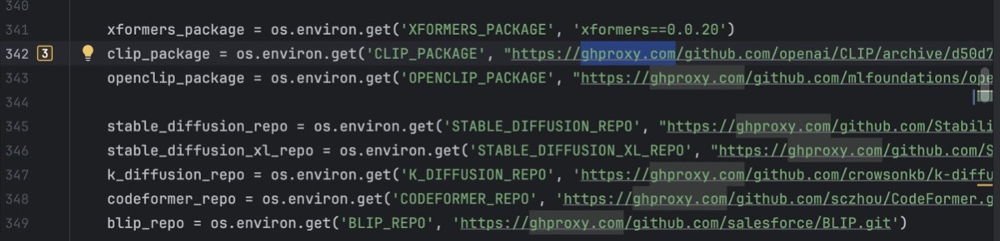
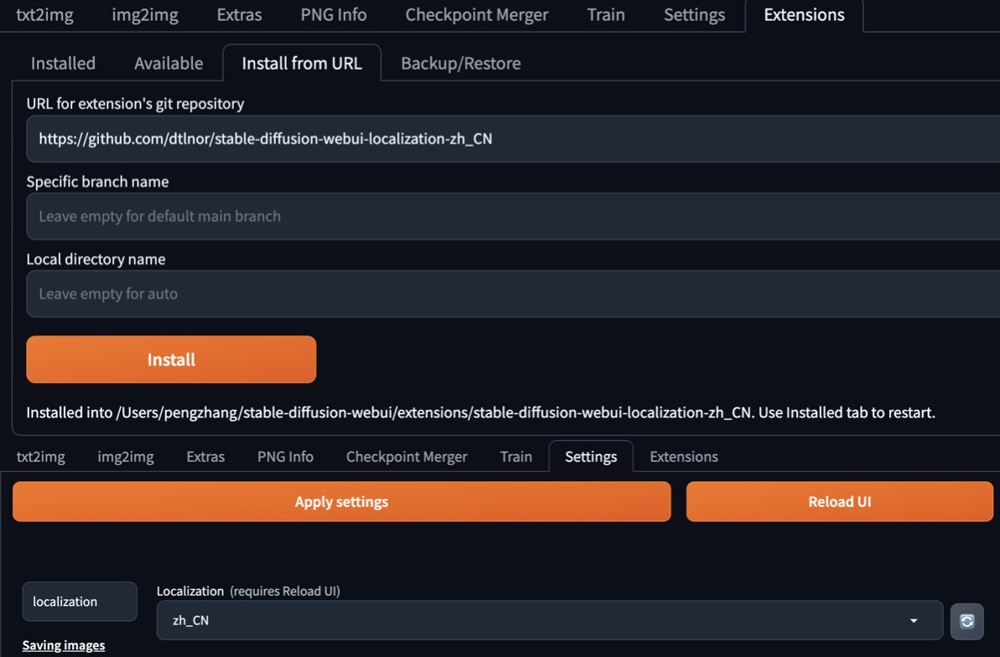

### 安装homebrew

`/bin/bash -c "$(curl -fsSL https://gitee.com/ineo6/homebrew-install/raw/master/install.sh)”`

---

### 安装 stable diffusion webui 的依赖

`brew install cmake protobuf rust python@3.10 wget`

---


### Pip设置镜像

`pip config set global.index-url https://mirrors.aliyun.com/pypi/simple/`

若设置pip config的时候遇到**permission**的问题，可以对其上级文件夹`sudo chmod -R 777` 文件夹路径，使得pip config可以设置成功

---

### 下载 stable diffusion webui 代码

```
cd ~
git clone https://gitee.com/ineo6/stable-diffusion-webui.git
```

---

### 启动 stable diffusion webui 本体
```
cd ~
/stable-diffusion-webui ./webui.sh
```

在启动的过程中需要从github中拉取一些组件，需要切换github的加速源，一般选择自营加速源：

`/bin/bash -c "$(curl -fsSL https://gitee.com/ineo6/stable-diffusion-webui/raw/master/super-gh.sh)”`

```
1) ghproxy.com      3) ghps.cc               5)hub.gitmirror.com
2) 自营加速源          4) gh.ddlc.top        6) gh.con.sh
 #?
```

另外找到stable diffusion webui的工程文件夹，找到**modules/launch_utils.py**的文件，给github组件的路径前添加`ghproxy.com/`，示例如下：



若报错**Can't load tokenizer for ‘openai/clip-vit-large-patch14’**，则是因为其从huggingface拉取失败，可以自行下载并放置到*stable-diffusion-webui/openai/clip-vit-large-patch14*，这样处理完就可以启动成功了。

若出现Running on local URL:  http://127.0.0.1:7860并弹出界面，则启动成功了。

---

### 下载模型checkpoint和微调权重lora


* 可从该网站下载：https://civitai.com/
* 下载的checkpoint可放置到**stable-diffusion-webui/models/Stable-diffusion**路径下
* 下载的lora权重文件可放置到**stable-diffusion-webui/models/Lora**路径下
* 优秀的写真模型如：
  **majicMIX realistic 麦橘写实**
  **iNiverse Mix(SFW & NSFW)**

---

### 中文包下载安装

* 路径：https://github.com/dtlnor/stable-diffusion-webui-localization-zh_CN
* 下载完成后，在设置中的localization中选择简体中文，之后保存设置并reload UI即可


---

### 文生图参数设置

* 采样器：DPM++ 3M SDE Karras
* 迭代步数：30
* 分辨率：768*1344
* Hires.fix：R-ESRGAN 4x+
* 重绘幅度：0.3
* 重绘迭代步数：12
* Clip skip：2
* CFG Scale：6
* 正面提示词：

```
(基础设定)
RAW photograph, ultra-detailed skin, subsurface scattering,
(解剖结构)
  perfect female anatomy, natural breast gravity, physiological accuracy,
(皮肤科学)
  realistic skin texture, visible pores, subtle veins, natural skin variations,
(光学参数)
  shot on Canon EOS R5, 85mm f/1.4, studio softbox lighting,
(生物力学)
  natural body posture, relaxed muscle tension, authentic weight distribution
```

* 负面提示词：

```
(核心解剖结构修复)
(malformed genitals:1.6), (asymmetric breasts:1.5), (disproportioned body:1.4),
  (deformed fingers:1.5), (mutated hands:1.3), (fused fingers:1.4),
  (unnatural waist ratio:1.3), (twisted torso:1.2), (broken joints:1.4),
  (皮肤质感强化)
  (plastic skin:1.7), (wax skin:1.6), (shiny skin:1.5), (airbrushed:1.4),
  (uneven skin tone:1.3), (exaggerated pores:1.2), (cellulite:1.1),
  (动态与姿势排除)
  (impossible pose:1.4), (floating limbs:1.3), (awkward posture:1.2),
  (stiff pose:1.3), (t-pose:1.5), (unnatural bending:1.4),
  (医学级真实控制)
  (suture marks:1.3), (surgical scars:1.2), (stretch marks:0.8),
  (varicose veins:0.7), (bruises:1.1), (skin folds:0.9),
  (光影与渲染缺陷)
  (overexposed:1.2), (underexposed:1.3), (harsh lighting:1.4),
  (flat lighting:1.5), (unnatural shadows:1.3), (SSR artifacts:1.6),
  (风格污染排除)
  (3D render:1.7), (CGI:1.6), (anime:1.8), (cartoon:1.8),
  (painting:1.5), (drawing:1.4), (watercolor:1.3),
  (微观缺陷修复)
  (skin stretching:1.2), (unnatural creases:1.3), (floating hair:1.1),
  (irregular areola:1.4), (misaligned labia:1.5), (asymmetric nipples:1.4)
```

### 参考教程：

[mac极速安装stable diffusion webui教程]([https://](https://brew.idayer.com/install/stable-diffusion-webui/))
